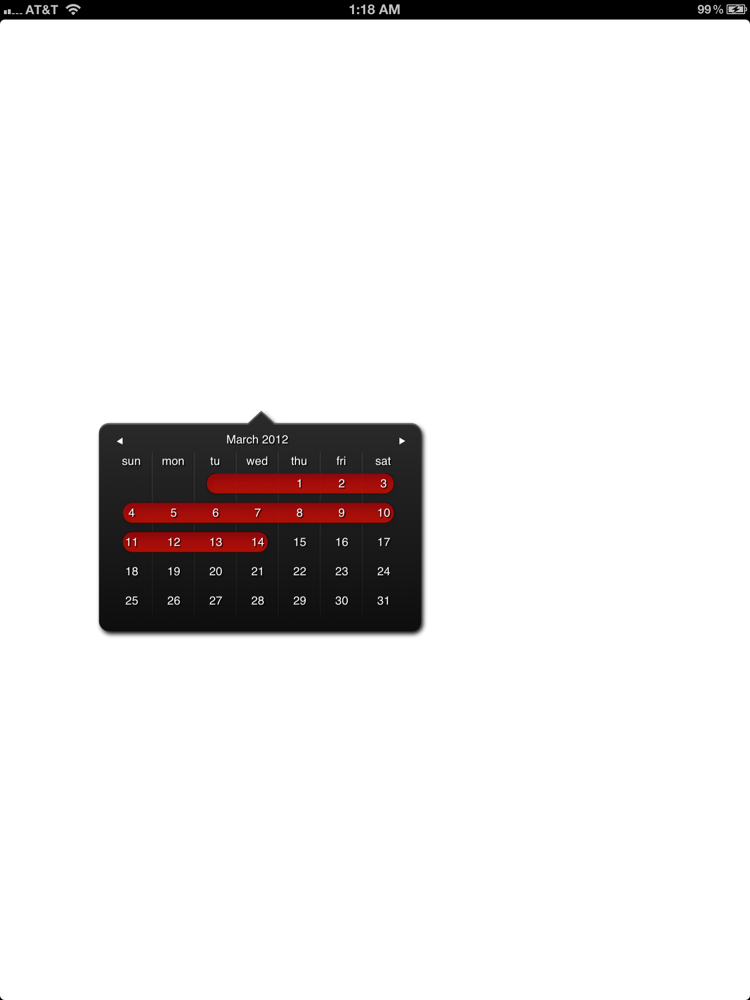

#OCCalendarController#

##Introduction##

OCCalendar is a very simple component for iPhone/iPad that provides a "Popover" date picker controller.  It is very easy to add to your project, and is 100% CoreGraphics code, so it uses no images, and is resolution independent.

##Usage##

Drag the following files into your project:

* OCCalendarViewController.h
* OCCalendarViewController.m
* OCCalendarView.h
* OCCalendarView.m
* OCSelectionView.h
* OCSelectionView.m
* OCDaysView.h
* OCDaysView.m

Then implement the OCCalendarDelegate protocol in the class you wish to call from.  The only method in this protocol specifies a way for the calendar to report back the beginning and ending ranges of dates.  These are returnes as NSDate objects for convenience.  In the demo app, we do the following:

`- (void)completedWithStartDate:(NSDate *)startDate endDate:(NSDate *)endDate {
    NSDateFormatter *df = [[NSDateFormatter alloc] init];
    [df setDateStyle:NSDateFormatterShortStyle];
    
    [self showToolTip:[NSString stringWithFormat:@"%@ - %@", [df stringFromDate:startDate], [df stringFromDate:endDate]]];
    
    calVC.delegate = nil;
    [calVC release];
    calVC = nil;
}`

Now, you should be able to show the calendar by alloc'ing and init'ing it, then adding to your view.

`//Here's where the magic happens
    calVC = [[OCCalendarViewController alloc] initAtPoint:CGPointMake(150, 50) inView:self.view];
    calVC.delegate = self;
    [self.view addSubview:calVC.view];`

##Customization##
You can customize the look and feel of the controller by tweaking the CoreGraphics rendering code.  I realize that this is not very pretty at the moment, but I'll eventually refactor it to make sure it's all neat and tidy.  You can change the placement of the little arrow to either the right or left side of the popover by changing the "arrowPosition" int.

`arrowPosition = -1 // This is for arrow-left
arrowPosition = 0 // Arrow is centered
arrowPosition = 1 // Arrow is on the right